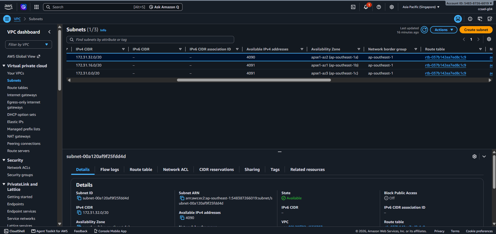
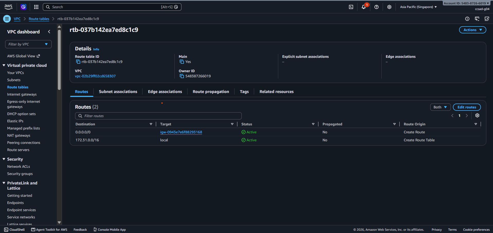
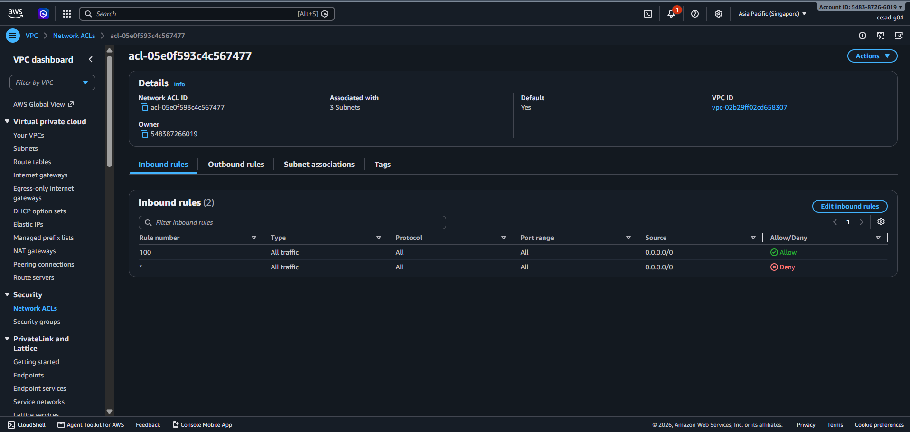
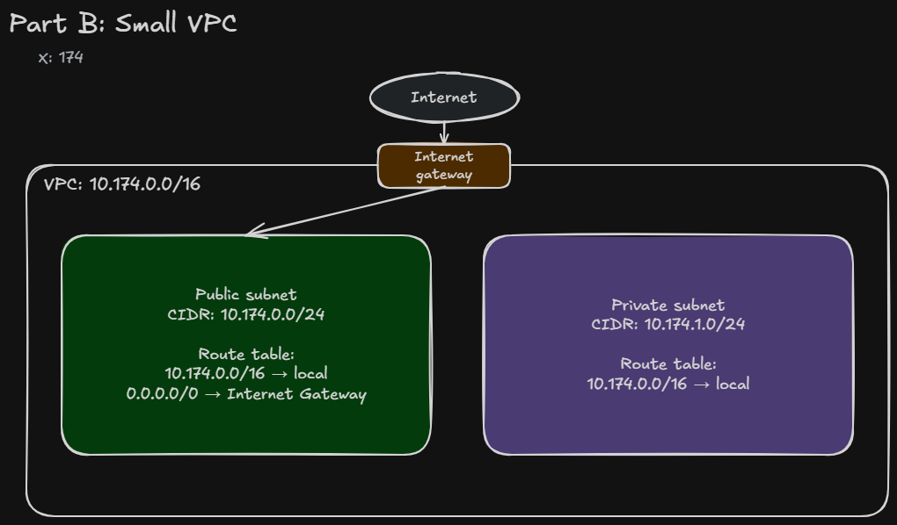

# Assignment 2 Submission

## About me

- GitHub username: StDevRhenz
- Section: IV-CCSAD
- IAM user name that I signed in with: ccsad-g04
- X: 174

---

## Part A. Explore
    
### A1. The VPC

Default VPC IPv4 CIDR:

172.31.0.0/16

Number of addresses in that CIDR:

65,536

### A2. The subnets

| Availability Zone | IPv4 CIDR |
| --- | --- |
| apse1-az2 (ap-southeast-1a) | 172.31.32.0/20 |
| apse1-az1 (ap-southeast-1b) | 172.31.16.0/20 |
| apse1-az3 (ap-southeast-1c) | 172.31.0.0/20  |

### A3. Available addresses

Available IPv4 addresses in each subnet:

`172.31.32.0/20`: 4,090; 
`172.31.16.0/20`: 4,091; 
`172.31.0.0/20`: 4,091.

Why is the number lower than 4,096?

Each `/20` subnet has 4,096 total IPv4 addresses. AWS reserves five addresses in every subnet, so an empty `/20` subnet normally has 4,091 available addresses. The remaining addresses can be used by network interfaces or other AWS resources.

What uses the missing address in the subnet with the lowest number?

The EC2 instance's network interface uses one additional IPv4 address, leaving 4,090 available addresses in the subnet.

### A4. The route table

| Destination | Target |
| --- | --- |
| 0.0.0.0/0 | igw-0943e7e6f88293168 |
| 172.31.0.0/16 | local |

### A5. Public or private

Are the default subnets public or private? Which route proves it?

The default subnets are public. The route `0.0.0.0/0` to the internet gateway `igw-0943e7e6f88293168` proves this.

### A6. The internet gateway

State of the internet gateway:

Attached

What happens to the default subnets if the gateway is detached?

The default subnets lose their connection to the internet, but the local route still allows resources inside the VPC to communicate.

### A7. NAT gateways

Number of NAT gateways:
0

Can a server in a new private subnet download updates? Why?

No. There is no NAT gateway and no route from the private subnet to the internet, so the server cannot download updates.

### A8. The network ACL

| Rule number | Source | Allow or Deny |
| --- | --- | --- |
| 100 | 0.0.0.0/0 | Allow |
| * | 0.0.0.0/0 | Deny |

How is a network ACL different from a security group?

A network ACL protects a whole subnet and is stateless. It supports both allow and deny rules. A security group protects a resource, is stateful, and supports allow rules only.

### A9. The default security group

Inbound rule (type and source):

All traffic — `sg-0c5b6d4081cf0a534` / `default`

Which resources can send traffic to an instance that uses it?

Only resources that also use the `default` security group can send inbound traffic.

---

## Part B. Prepare

### B1. Plan two subnets

- Public subnet CIDR: 10.174.0.0/24
- Private subnet CIDR: 10.174.1.0/24

### B2. Route tables

Route table of the public subnet:

| Destination | Target |
| --- | --- |
| 10.174.0.0/16 | local |
| 0.0.0.0/0 | internet gateway |

Route table of the private subnet:

| Destination | Target |
| --- | --- |
| 10.174.0.0/16 | local |

### B3. My VPC diagram

Tool used (Excalidraw, draw.io, Lucidchart, or paper):

Excalidraw

### B4. Predict a change

Can you still open the web page from your laptop? Why?

No. Without the `0.0.0.0/0` route to the internet gateway, the instance no longer has a route for internet traffic.

Can the instance still reach another instance in the VPC? Why?

Yes. The local route `10.174.0.0/16` still allows communication between instances in the same VPC.

### B5. Place a database

Which subnet gets the database? Why?

The database goes in the private subnet, `10.174.1.0/24`, because it has no direct route to the internet gateway and is protected from direct internet access.

### B6. My question about VPCs

What is your question, and what made you think of it?

How does a private subnet securely access an application in a public subnet? I thought of this because databases are usually placed in private subnets.